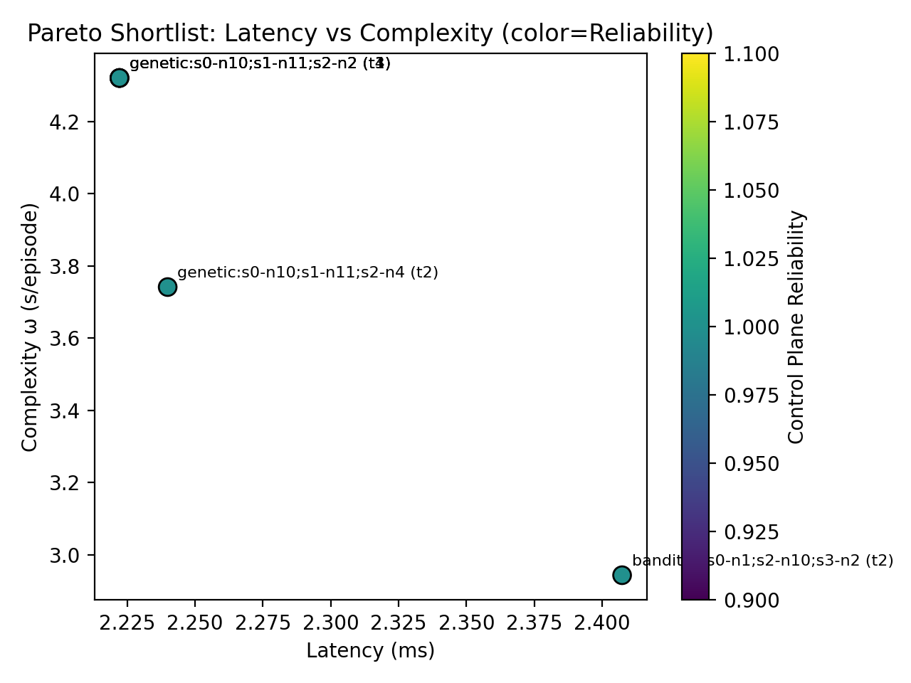

# Decision-Grade Multi-Objective Benchmarking of SDN Controller Placement

## Slide 1 — Title
Decision-Grade Multi-Objective Benchmarking of SDN Controller Placement

Presenter: [Your Name]

## Slide 2 — Problem
- Controller placement affects latency, reliability, and operational cost.
- Literature often reports latency gains without cost accounting.

## Slide 3 — Research Question
- When do AI methods remain Pareto-dominant after accounting for latency (L), reliability (R), and complexity (ω)?

## Slide 4 — Methodology
- Factorial design: algorithms × topologies × controller budgets
- Metrics: `average_distance`, `control_plane_reliability`, `omega` (s/episode)

## Slide 5 — Phase 5 Results (Pareto Shortlist)

## Slide 6 — Phase 6 Plan
- Validate shortlist in Mininet on Internet2 and ATT-MPLS
- Internet2 validation uses topology-native greedy k-center controller placement for the same controller budget
- Command: `python3 scripts/validate_shortlist_mininet.py --benchmark-input results/experiment_data/benchmark_20260309_044937.csv --allow-fallback`

## Slide 7 — Reliability Check Summary
- See `notes/reliability_analysis.md` for the sweep results across seeds and Internet2 check.

## Slide 8 — Demo Plan
- Run `python3 scripts/quick_verify.py`
- Show `results/pilot_metrics.json` summary

## Slide 9 — Takeaway
- AI is promising but must be judged in a multi-objective frame; the pipeline provides decision-grade evidence.
